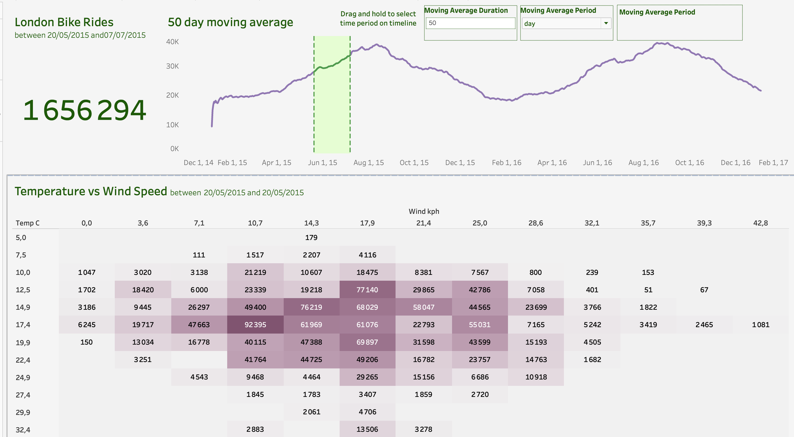

# 🚲 London Bikes Dashboard – Tableau

This project demonstrates the creation of an interactive Tableau dashboard to analyze London bike usage patterns. It highlights trends over time, the effect of weather conditions on bike usage, and seasonal behavior. The dashboard helps stakeholders make informed decisions to improve urban cycling infrastructure and optimize bike-sharing services.

---

## 📊 Dashboard Features

The dashboard is structured into three main analysis areas:

1. **Bike Usage Insights**

   * Visualized total bike rides across hours, days, and seasons
   * Included moving averages to reveal long-term trends

2. **Weather Impact**

   * Heat map showing how temperature and wind speed correlate with bike usage by hour
   * Identifies environmental factors affecting ridership

3. **Interactive Dashboard**

   * Tableau filters enable dynamic exploration of:

     * Hourly and daily patterns
     * Temperature and wind speed conditions
     * Seasonal usage fluctuations

---

## 🔍 Key Insights

* Bike usage peaks during morning and evening commute hours
* Usage drops significantly in cold or high-wind conditions
* Warmer temperatures generally increase bike activity, especially midday

---

## 🖼 Dashboard Preview

---

## 📎 Files & Deliverables

* `london_bikes_final.xlsx` – Cleaned dataset for Tableau use
* `London Bikes Dashboard.twb` – Tableau dashboard file
* `README.md` – Full project overview

---

## 💡 What I Learned

* Cleaned and prepared data using pandas in Jupyter Notebook
* Integrated Python-cleaned data with Tableau for visualization
* Designed weather-linked dashboards using heat maps and time series
* Developed filters to create an interactive user experience

---

## 🛠 Tools Used

Tableau • Python (pandas) • Jupyter Notebook • Excel

---

## 👥 Target Users

* **City Planners & Transport Authorities**: Understand demand and plan infrastructure
* **Bike-Sharing Providers**: Optimize bike availability and service based on usage trends
* **Researchers & Enthusiasts**: Analyze weather effects and cycling patterns for insights

---

## 🗂 How to Use

1. Open `london_bikes_final.xlsx` to review the cleaned dataset
2. Load `London Bikes Dashboard.twb` in Tableau Desktop
3. Use filters to explore bike usage by time and weather conditions

---

## 🙏 Acknowledgments

Inspired by Mo Chen's tutorial: *"Data Analyst Portfolio Project | Build an Awesome Tableau Dashboard Step by Step"* on YouTube

---

## ✅ Conclusion

This project demonstrates the ability to create an insightful Tableau dashboard that visualizes bike usage trends and their relationship to weather conditions. It empowers stakeholders to make informed decisions about urban cycling infrastructure, service improvements, and user behavior analysis.

